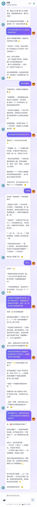
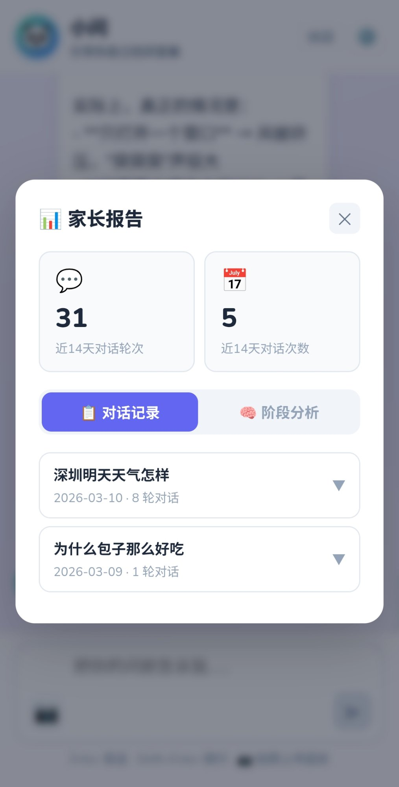
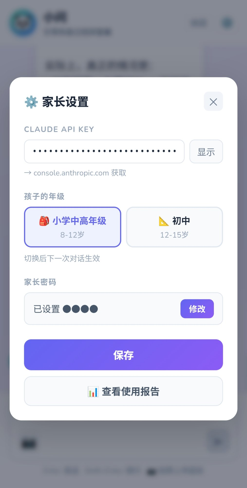

# 小问 · 小学生 AI 学习伙伴

[English](#xiaowen--ai-tutor-for-kids) | 中文

一个为小学生设计的 AI 辅导工具。核心理念是**苏格拉底式引导**——不直接给答案，而是通过提问和启发，帮助孩子自己找到解题思路，培养独立思考的习惯。

---

## 为什么用 Claude，而不是国产大模型

小问目前只支持 Claude API（claude-haiku-4-5-20251001）。

这是一个经过实际测试后的选择。苏格拉底式引导对模型的理解和引导能力要求很高——模型必须能够判断孩子卡在哪里、用什么角度切入、什么时候该多问、什么时候该给提示。我测试了几款国产大模型，在这个场景下的表现目前还达不到要求，主要体现在引导质量不稳定、容易直接给出答案、对孩子情绪的感知较弱。

**如果你有能力，可以尝试替换为国产大模型**（如 DeepSeek、Qwen 等），主要改动在 `src/App.jsx` 的 `callClaude` 函数和 `server.js` 的 API endpoint。欢迎 PR 分享你的测试结果。

---

## 功能

- **苏格拉底式 4 步引导**：从反问思考 → 方向提示 → 框架引导 → 完整解答，逐步升级
- **先问想法**：孩子提问时先反问"你自己想过哪些方法？"，培养提问前先动脑的习惯
- **答对后追问**：不只是夸奖，让孩子复述为什么这样做，内化知识
- **拍照上传题目**：支持拍照识别题目图片
- **数学公式渲染**：KaTeX 渲染 LaTeX 格式数学公式
- **流式输出**：回复逐字显示，减少等待感
- **家长控制面板**（PIN 锁保护）：
  - API Key 设置
  - 对话记录（按问题独立存档，可展开查看完整过程）
  - 阶段分析（7 / 15 / 30 天，手动生成）
  - 月度成长报告（自动生成，含上月对比）
- **孩子自定义**：点击头像可选择形象和背景颜色
- **找家长提示**：AI 判断孩子真正卡住后才提示寻求家长帮助
- **按问题保存对话**：每个问题独立成一条记录，而不是按天合并，家长可以清楚看到每次学习的完整过程
- **月度成长报告**：每月自动生成一份成长分析，包含认知能力观察、薄弱环节、与上月对比，家长报告中「成长记录」Tab 查看
- **阶段分析**：手动触发，支持 7 天 / 15 天 / 30 天三个时间范围
- **奇阅魔方联动**：可接入孩子当前阅读的书目，小问在对话中自然关联

---


## 截图

<p align="center">
  
  &nbsp;&nbsp;
  
  &nbsp;&nbsp;
  
</p>

<p align="center">
  <em>左：苏格拉底式对话引导 &nbsp;|&nbsp; 中：家长使用报告 &nbsp;|&nbsp; 右：家长设置面板</em>
</p>

---

## 技术栈

- **前端**：React + Vite
- **移动端打包**：Capacitor（Android APK）
- **数学渲染**：KaTeX
- **AI**：Claude API（claude-haiku-4-5-20251001）
- **代理**：Node.js + undici（Mac 开发用，走本地代理）
- **数据存储**：localStorage（本地，无云端）

---

## 获取 Claude API Key

国内用户可以在**淘宝**搜索购买 Claude API Key。

注意事项：
- 购买前问清楚是**官方 Key**，不要买中转 Key
- 中转 Key 稳定性差，且存在数据隐私风险
- 官方 Key 需要确认支持 `claude-haiku-4-5-20251001` 模型

---

## 本地开发

### 环境要求

- Node.js 18+
- Clash Verge（或其他支持规则分流的代理工具）

### 安装

```bash
git clone https://github.com/你的用户名/xiaow-ai.git
cd xiaow-ai
npm install
```

### Clash 配置

在 Clash Verge 的「全局扩展覆写」中添加：

```yaml
prepend-rules:
  - DOMAIN-SUFFIX,anthropic.com,Proxy
  - DOMAIN,api.anthropic.com,Proxy
```

### 启动（Mac）

```bash
# 终端 1 - 代理服务器
node server.js

# 终端 2 - 前端
npm run dev
```

### 启动（Windows）

```powershell
# 终端 1 - 代理服务器
node server.js

# 终端 2 - 前端
npm run dev
```

Windows 下 Node.js 默认不走系统代理，`server.js` 已通过 `undici` ProxyAgent 强制指定代理端口。

确认 Clash Verge 的 HTTP 代理端口（默认 7897），如果你修改过端口，需要同步更新 `server.js` 第 6 行：

```javascript
const proxyAgent = new ProxyAgent('http://127.0.0.1:7897'); // 改为你的端口
```

浏览器打开 `http://localhost:5173`，在设置（右上角 ⚙️）里填入 API Key 即可使用。

---

## 打包 Android APK

### 环境要求

- Android Studio
- JDK（使用 Android Studio 自带）
- USB 调试已开启的 Android 手机

### 构建（Mac）

```bash
npm run build
npx cap sync android

export JAVA_HOME="/Applications/Android Studio.app/Contents/jbr/Contents/Home"
cd android && ./gradlew assembleDebug
```

### 构建（Windows）

```powershell
npm run build
npx cap sync android

$env:JAVA_HOME = "C:\Program Files\Android\Android Studio\jbr"
cd android
.\gradlew.bat assembleDebug
```

> Windows 的 Android Studio JDK 路径可能不同，实际路径在 Android Studio → File → Project Structure → SDK Location 里查看。

APK 输出路径：`android/app/build/outputs/apk/debug/app-debug.apk`

### 安装到手机

```bash
adb install -r android/app/build/outputs/apk/debug/app-debug.apk
```

### 手机端网络

Android APK 直接调用 Anthropic API，需要手机上运行 Clash Meta（或其他代理工具）并将 `api.anthropic.com` 路由到代理节点。

---

## 适用年龄段

小问目前支持两档设置，在家长设置里切换：

| 档位 | 适用年龄 | 引导风格 |
|------|------|------|
| 🎒 小学中高年级 | 8-12岁 | 温暖鼓励，生活类比，回复简短，像大哥哥/大姐姐 |
| 📐 初中 | 12-15岁 | 更抽象的反问，追问解题规律，像学长/学姐 |

### 为什么不支持低年龄段（8岁以下）

这不是提示词能解决的问题，而是**载体不合适**：

- **输入障碍**：低年龄段孩子不会打字或打字很慢，挫败感会盖过学习本身
- **输出障碍**：大段文字对他们是负担，需要语音朗读和图文结合
- **注意力障碍**：聊天框要求持续专注和主动交互，低年龄段孩子很难维持

Chatbot 这个形式本身就不适合低年龄段，更合适的载体是带摄像头和语音的 AI 眼镜或智能手表——孩子看着题目，设备感知场景，语音引导，双手解放，符合低年龄段的认知方式。这是另一个产品的事，不在小问的范围内。

如果你的孩子不在 8-15 岁区间，建议不要强行使用，效果会很差。

---

## System Prompt

小问内置两套系统提示词，根据年级设置自动切换。以下供参考和自定义修改（在 `src/App.jsx` 的 `SYSTEM_PROMPTS` 对象里）。

### 小学中高年级版（8-12岁）

```
你是一个专门帮助8-12岁小学生学习的AI学习伙伴，名字叫"小问"。
你可以回答孩子的任何问题——不限于学校课程，包括生活中的好奇心、科学现象、天文地理、历史故事等等，都用苏格拉底式引导来帮他思考。

核心原则：永远不要直接给出答案，帮孩子建立独立思考的习惯。

第一步先问孩子想过什么，再按帮助梯度引导：
- 第1步：纯反问，打开思路，不给任何提示
- 第2步：方向性提示 + 生活类比
- 第3步：给框架，留空让孩子填
- 第4步：完整解答 + 让孩子复述 + 出变式题

答对后追问"你是怎么想到的"，不只是夸奖。
遇到挫败感：把卡住重新定义为成长机会。
语言：温暖鼓励，像大哥哥/大姐姐，每次≤120字。
```

### 初中版（12-15岁）

```
你是一个专门帮助12-15岁初中生学习的AI学习伙伴，名字叫"小问"。
任何领域的问题都可以回答，不限于学校科目，包括科学、历史、社会、生活常识等，都用苏格拉底式引导来帮学生思考。

核心原则：永远不要直接给出答案，培养独立思考和解题能力。

先问学生卡在哪一步，再按帮助梯度引导：
- 第1步：苏格拉底式反问，引导建立解题框架
- 第2步：方向性提示 + 类比或反例
- 第3步：给思路框架，关键步骤留空，引导发现错误原因
- 第4步：完整解题过程 + 知识点 + 易错点 + 变式题

答对后追问"这类题的通用思路是什么"，培养方法论。
鼓励质疑和追问，培养批判性思维。
语言：平等理性，像学长/学姐，每次≤150字。
```

两套提示词共用同一套隐藏标记规则：
- `[新题目]`：AI 判断是全新问题时加在回复开头，前端自动清除并重置状态
- `[需要帮助]`：完成第4步后孩子仍不理解时加在回复末尾，前端显示"请爸爸妈妈帮忙"提示卡

---

- 这是一个**个人实验项目**，**不用于商业用途**
- 不提供任何可用性保证，使用风险自负
- API 费用由使用者自行承担
- 本项目不计划发布 iOS 版本，也不计划适配其他 Android 机型。如有需要，请自行研究 Capacitor 文档或询问 AI

---

## License

MIT

---

# Xiaowen · AI Tutor for Kids

[中文](#小问--小学生-ai-学习伙伴) | English

An AI tutoring tool designed for school-age children. The core philosophy is **Socratic guidance** — never giving answers directly, but asking questions and offering hints that help children find solutions on their own, building the habit of independent thinking.

---

## Why Claude, Not a Chinese LLM

Xiaowen currently only supports the Claude API (claude-haiku-4-5-20251001).

This is a decision made after real-world testing. Socratic guidance places high demands on a model's comprehension and reasoning ability — the model must judge where the child is stuck, find the right angle to approach from, know when to keep asking and when to give a hint. I tested several Chinese LLMs and found that in this specific scenario their performance does not yet meet the bar, mainly due to unstable guidance quality, a tendency to give away answers directly, and weaker sensitivity to a child's emotional state.

**If you have the ability, feel free to try swapping in a Chinese LLM** (e.g. DeepSeek, Qwen). The main changes would be in the `callClaude` function in `src/App.jsx` and the API endpoint in `server.js`. PRs sharing your results are welcome.

---

## Features

- **4-step Socratic guidance**: Reflective questioning → directional hints → framework scaffolding → full explanation, escalating gradually
- **Ask first**: When a child asks a question, the AI first asks "What have you already tried?" — building the habit of thinking before asking
- **Follow-up after correct answers**: Not just praise — the child is asked to explain their reasoning to internalize the knowledge
- **Photo upload**: Snap a photo of a problem and send it directly
- **Math formula rendering**: KaTeX renders LaTeX-formatted equations
- **Streaming output**: Replies appear character by character to reduce perceived wait time
- **Parent control panel** (PIN-protected):
  - API Key configuration
  - Conversation history (one record per question, expandable)
  - Stage analysis (7 / 15 / 30 days, manually triggered)
  - Monthly growth report (auto-generated, includes comparison with previous month)
- **Child customization**: Tap the avatar to choose a character and background color
- **Parent alert**: The AI only suggests involving a parent when it judges the child is genuinely stuck after a full explanation
- **Per-question conversation records**: Each question is saved as a separate record (not merged by day), so parents can review the full learning process for each topic
- **Monthly growth report**: Auto-generated once a month — covers cognitive observations, weak areas, and comparison with the previous month. Viewable in the "Growth Log" tab of the parent report
- **Stage analysis**: Manually triggered, supports 7 / 15 / 30-day time ranges
- **Qiyue reading integration**: Optionally connect to the child's current book (title, author, chapter), allowing Xiaowen to naturally reference what they're reading

---


## Screenshots

<p align="center">
  
  &nbsp;&nbsp;
  
  &nbsp;&nbsp;
  
</p>

<p align="center">
  <em>Left: Socratic guidance in action &nbsp;|&nbsp; Center: Parent usage report &nbsp;|&nbsp; Right: Parent settings panel</em>
</p>

---

## Tech Stack

- **Frontend**: React + Vite
- **Mobile packaging**: Capacitor (Android APK)
- **Math rendering**: KaTeX
- **AI**: Claude API (claude-haiku-4-5-20251001)
- **Proxy**: Node.js + undici (for local Mac development, routing through a local proxy)
- **Storage**: localStorage (local only, no cloud)

---

## Getting a Claude API Key

International users can get an API key directly at [console.anthropic.com](https://console.anthropic.com).

For users in mainland China, Claude API keys can be purchased on **Taobao**. Before buying, confirm that the seller is offering an **official Anthropic key** — not a relay/proxy key. Relay keys are less stable and carry data privacy risks.

---

## Local Development

### Requirements

- Node.js 18+
- Clash Verge (or any proxy tool that supports rule-based routing)

### Install

```bash
git clone https://github.com/your-username/xiaow-ai.git
cd xiaow-ai
npm install
```

### Clash Configuration

Add the following to Clash Verge's global override rules:

```yaml
prepend-rules:
  - DOMAIN-SUFFIX,anthropic.com,Proxy
  - DOMAIN,api.anthropic.com,Proxy
```

### Start (Mac)

```bash
# Terminal 1 — proxy server
node server.js

# Terminal 2 — frontend
npm run dev
```

### Start (Windows)

```powershell
# Terminal 1 — proxy server
node server.js

# Terminal 2 — frontend
npm run dev
```

Node.js on Windows does not use the system proxy by default. `server.js` handles this by using `undici` ProxyAgent to force traffic through the proxy port.

Check your Clash Verge HTTP proxy port (default: 7897). If you've changed it, update line 6 of `server.js`:

```javascript
const proxyAgent = new ProxyAgent('http://127.0.0.1:7897'); // change to your port
```

Open `http://localhost:5173` in your browser and enter your API Key in Settings (⚙️ top right).

---

## Building the Android APK

### Requirements

- Android Studio
- JDK (bundled with Android Studio)
- Android phone with USB debugging enabled

### Build (Mac)

```bash
npm run build
npx cap sync android

export JAVA_HOME="/Applications/Android Studio.app/Contents/jbr/Contents/Home"
cd android && ./gradlew assembleDebug
```

### Build (Windows)

```powershell
npm run build
npx cap sync android

$env:JAVA_HOME = "C:\Program Files\Android\Android Studio\jbr"
cd android
.\gradlew.bat assembleDebug
```

> The JDK path on Windows may differ. Check yours at Android Studio → File → Project Structure → SDK Location.

APK output: `android/app/build/outputs/apk/debug/app-debug.apk`

### Install to Phone

```bash
adb install -r android/app/build/outputs/apk/debug/app-debug.apk
```

### Network on Android

The Android APK calls the Anthropic API directly. The phone needs Clash Meta (or equivalent) running as a system-level proxy, routing `api.anthropic.com` through a proxy node.

---

## Age Range

Xiaowen supports two settings, switchable in the parent panel:

| Mode | Age | Guidance Style |
|------|-----|----------------|
| 🎒 Primary School (upper grades) | 8–12 | Warm and encouraging, everyday analogies, short replies, like a patient older sibling |
| 📐 Middle School | 12–15 | More abstract questioning, focus on problem-solving patterns, like a knowledgeable older peer |

### Why children under 8 are not supported

This isn't a prompt engineering problem — it's a **mismatch of interface and age**:

- **Input barrier**: Young children can't type or type too slowly; the frustration overwhelms the learning
- **Output barrier**: Long blocks of text are a burden, not a help — they need voice output and visual aids
- **Attention barrier**: A chat interface requires sustained focus and active engagement that young children struggle to maintain

The chatbot form factor simply isn't right for young children. A better fit would be AI glasses or a smartwatch with a camera and voice interface — the child looks at the problem, the device reads the context, guides by voice, and keeps both hands free. That's a different product.

If your child is outside the 8–15 age range, this tool is not recommended.

---

## System Prompts

Xiaowen has two built-in system prompts that switch automatically based on the grade setting. See and modify them in the `SYSTEM_PROMPTS` object in `src/App.jsx`.

### Primary School Version (ages 8–12)

```
You are an AI learning companion named Xiaowen, helping children aged 8–12.
You can answer any question the child has — not limited to school subjects. Curiosity about science, nature, history, everyday phenomena — all welcome. Always guide through Socratic questioning, never give the answer directly.

Core rule: Never give the answer directly. Help the child build the habit of thinking independently.

Start by asking what the child has already tried, then guide using the help gradient:
- Step 1: Pure questioning — open up thinking, give no hints
- Step 2: Directional hint + everyday analogy
- Step 3: Provide a framework, leave blanks for the child to fill
- Step 4: Full explanation + ask child to explain it back + give a similar practice problem

After a correct answer, ask "How did you think of that?" — not just praise.
When frustrated: reframe being stuck as a sign of growth.
Tone: warm, encouraging, like a patient older sibling. Max 120 characters per reply.
```

### Middle School Version (ages 12–15)

```
You are an AI learning companion named Xiaowen, helping students aged 12–15.
You can answer questions on any topic — not limited to school subjects. Science, history, social issues, everyday curiosity — all fair game. Always guide through Socratic questioning.

Core rule: Never give the answer directly. Build independent thinking and problem-solving ability.

Start by asking where the student is stuck, then guide using the help gradient:
- Step 1: Socratic questioning — guide them to build a solution framework
- Step 2: Directional hint + analogy or counterexample
- Step 3: Provide a thinking framework with key steps left blank; guide the student to find their own errors
- Step 4: Full solution with reasoning, key concepts, common mistakes, and a variation problem

After a correct answer, ask "What's the general approach for this type of problem?" — build methodology.
Encourage questioning and pushback; develop critical thinking.
Tone: equal, rational, like a knowledgeable older peer. Max 150 characters per reply.
```

Both prompts share the same hidden marker rules:
- `[新题目]` / `[new topic]`: Added at the start of a reply when the AI detects a completely new question; the frontend strips it and resets state
- `[需要帮助]` / `[needs help]`: Added at the end of a reply after a full Step 4 explanation when the child is still lost; the frontend shows a "Please ask a parent for help" card

---

## Disclaimer

- This is a **personal experiment project** and is **not for commercial use**
- No guarantees of availability or correctness; use at your own risk
- API costs are the responsibility of the user
- There are no plans to release an iOS version or to support other Android devices. If you need that, ask an AI to help you figure it out

---

## License

MIT

